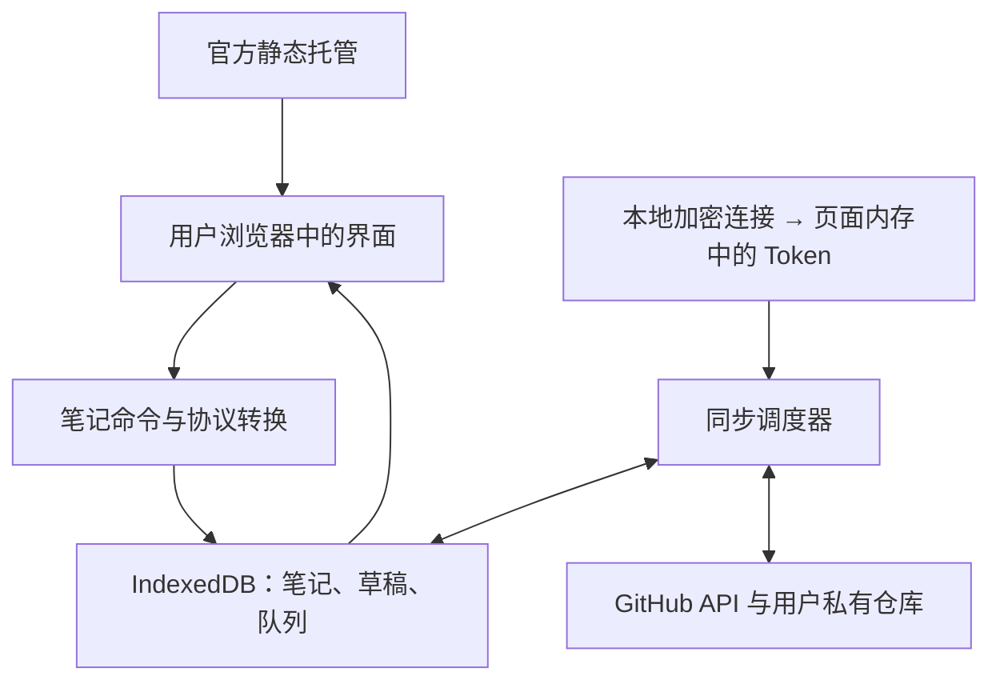

# Issue Notes：需求背景、架构设计与技术栈

版本：1.0（包含首版双语、暗色模式、可视化 Markdown 编辑要求）  
编写日期：2026-09-15  
文档用途：作为产品开发、实现评审和交付验收的共同依据。  
产品名称：Issue Notes 是本文使用的暂名，不代表最终品牌名称。

阅读顺序：产品与交互见第 1–4 节，架构与数据实现见第 5–9 节，技术栈与部署见第 10–13 节，开发验收见第 14 节，后续 AI 插件见第 15 节。

## 1. 项目定位与需求背景

### 1.1 一句话说明

开发一个接近 Google Keep 使用体验的网页笔记应用：官方统一部署静态前端，用户填写自己的 GitHub 仓库和 Token，浏览器直接通过 GitHub API 读写该仓库中的 Issues。

一条 Issue 对应一张笔记。用户可以在网页中快速记录、编辑、搜索、分类和归档，也能直接在 GitHub 中查看内容。用户无需 Fork 前端项目、部署服务或将笔记交给官方数据库。

### 1.2 需求来源

用户需要 Keep 那种打开即可记录、以卡片浏览碎片内容的工具，同时希望把持久数据放在自己的 GitHub 私有仓库中。

GitHub 已经提供 Markdown 正文、标签、开放与关闭状态、评论和访问权限，但原生 Issue 界面主要围绕研发协作设计。创建简单便签、浏览大量短笔记、调整卡片颜色和快速勾选清单时，可以提供更直接的交互。

本项目提供这层专门用于记笔记的界面，利用 GitHub 现有的数据和权限能力，降低官方运营服务与维护数据存储的成本。

### 1.3 目标用户与使用场景

| 用户或场景 | 需要完成的事情 | 产品提供的能力 |
| --- | --- | --- |
| 有 GitHub 账号的个人用户 | 随手保存想法、链接和待办 | 快速创建文本笔记或清单 |
| 开发者 | 记录排查过程、命令和技术片段 | Markdown、代码块、标签、原始 Issue 链接 |
| 多设备用户 | 在电脑记录，在手机继续编辑 | 同一仓库同步，响应式界面，PWA |
| 已使用 Issues 记笔记的用户 | 用更轻量的界面阅读和整理已有内容 | 读取已有 Issue，按需转换为受管理笔记 |
| 希望长期保留数据的用户 | 更换前端后仍能读取和导出笔记 | 可读的 Issue 正文、公开的数据协议、JSON 导出 |

### 1.4 核心目标

1. 官方部署一次，所有用户访问同一个网址，各自连接自己的仓库。
2. 生产环境仅提供静态文件；笔记业务不依赖官方后端、数据库或定时任务。
3. 已输入并成功保存到本地的内容在普通刷新、断网和请求失败后可以恢复。
4. 保存状态准确区分本地保存与 GitHub 同步成功。
5. 对用户已经存在的 Issue 内容和标签保持兼容。
6. 为后续 MCP 与 Skill 集成留下稳定的数据协议与可复用业务代码。

GitHub REST API 支持浏览器跨域调用，可以携带授权请求头执行读写；这是纯前端方案成立的基础。[GitHub 跨域请求文档][gh-cors]

### 1.5 产品边界

第一版围绕个人笔记工作流设计。官方不提供独立账号系统、跨用户共享空间、实时多人协同、图片上传服务、AI 模型调用或服务端后台同步。

私有仓库提供 GitHub 访问控制；本文方案不提供端到端加密。笔记正文以 Markdown 明文存放于 GitHub，本地缓存也需要在产品设置中明确说明。

Issues 属于 GitHub 平台数据，不属于 Git 提交中的文件。备份方案必须调用 API 或使用应用导出，不能把 `git clone` 当作 Issues 备份。

## 2. 已确定的设计决策

下表是实施默认值，开发者可以据此直接开始。调整这些决策时，需要同步修改协议、验收项和迁移说明。

| 事项 | 默认决策 |
| --- | --- |
| 产品形态 | 官方统一部署的响应式 SPA，可安装为 PWA |
| 后端 | 不建设笔记业务后端，浏览器直连 GitHub REST API |
| 数据位置 | 用户自己的 GitHub.com 私有仓库，使用 Issues 存储 |
| 第一版连接范围 | 一个账号、一个当前仓库；数据库结构预留多个连接的隔离能力 |
| 认证方式 | 用户提供 fine-grained PAT，限定目标仓库 |
| 凭证保存 | 默认仅当前会话；勾选记住连接后本地加密保存并自动恢复，断开时移除凭据及密钥 |
| 永久记住 Token | 后续增加口令加密保存，不作为第一版依赖 |
| 核心笔记类型 | Markdown 文本、简单待办清单 |
| 编辑器 | Milkdown 可视化 Markdown 编辑器，默认所见即所得，保留 Markdown 源码模式 |
| 界面语言 | 首版支持简体中文 `zh-CN` 与英文 `en`，可手动切换并记住选择 |
| 主题 | 首版支持浅色、暗色、跟随系统，覆盖所有页面和编辑器 |
| 标签 | 使用 GitHub 原生 Labels |
| 分类与筛选 | 分类采用 Labels；一张笔记可属于多个分类，浏览与预览共用组合筛选条件 |
| 颜色、置顶、回收站 | 保存到 Issue 正文开头的应用元数据块 |
| 归档 | 对应 Issue 的 closed 状态；恢复对应 open |
| 删除 | 第一版采用可恢复的回收站，不提供远端永久删除 |
| 本地持久化 | IndexedDB，使用 Dexie 管理 |
| 同步 | 本地先保存、显式写入队列、前台增量拉取、冲突时暂停写入 |
| 部署 | 输出通用 `dist/`，兼容 GitHub Pages 与其他静态托管 |
| AI 插件 | MCP＋Skill 列为后续阶段，不进入第一版发布包 |

第一版默认要求用户连接自己拥有的私有仓库。读取到公开仓库时提示选择私有仓库，不自动改变仓库可见性。组织仓库、协作者仓库和公开笔记模式作为后续兼容工作。

## 3. 功能范围与需求优先级

### 3.1 第一版必须实现

| 编号 | 功能 | 具体要求 |
| --- | --- | --- |
| F01 | 连接仓库 | 输入 `owner/repo` 或 GitHub 仓库网址、Token，检测身份、可见性与 Issues 可用性 |
| F02 | 快速记录 | 在首页点击「新建笔记」打开编辑器，创建标题可空的文本笔记 |
| F03 | 阅读与编辑 | 卡片预览、可视化 Markdown 编辑、源码模式切换、打开原始 Issue |
| F04 | 清单 | 新增、编辑、勾选、删除清单项；保留用户排列顺序 |
| F05 | 分类与标签 | 使用 GitHub Labels 建立分类，侧边栏分类导航；笔记支持多标签、添加、移除和新建 |
| F06 | 外观整理 | 卡片颜色、置顶与取消置顶、网格与列表视图 |
| F07 | 归档 | 归档笔记、查看归档列表、恢复到笔记列表 |
| F08 | 回收站 | 移入、查看、恢复；不自动清空，不承诺到期后台删除 |
| F09 | 搜索筛选 | 浏览及预览共用标签、颜色、类型、置顶、状态、时间的组合筛选与排序 |
| F10 | 本地与云端保存 | 自动本地草稿、云端保存队列、显式重试、准确显示状态 |
| F11 | 外部修改兼容 | 同步 GitHub 网页上的正文、状态和标签变化；检测与本地编辑的冲突 |
| F12 | 已有 Issues | 独立入口阅读未带应用元数据的 Issue，用户点击转换后才开始管理 |
| F13 | 数据导出 | 导出完整 JSON；导出单条可读 Markdown |
| F14 | 手机与 PWA | 响应式布局，缓存应用外壳，离线阅读和编辑已有本地笔记 |
| F15 | 设置与退出 | 切换主题、显示连接信息、断开连接、清除此设备的数据 |
| F16 | 空态与错误态 | 无笔记、无匹配、离线、Token 失效、权限不足、限流均有明确提示 |
| F17 | 界面语言 | 简体中文和英文即时切换，包含编辑器菜单、错误、空态、无障碍标签 |
| F18 | 暗色模式 | 浅色、暗色、跟随系统；持久保存偏好，避免启动时主题闪烁 |

### 3.2 后续功能

| 阶段 | 事项 | 与第一版的关系 |
| --- | --- | --- |
| P1 | 使用本地口令加密保存 Token | 改善再次打开时的连接体验 |
| P1 | 多仓库、多账号连接切换 | 复用第一版的账号与仓库隔离设计 |
| P1 | JSON 导入、批量 Markdown 导出 | 在现有数据协议与导出格式上扩展 |
| P1 | 评论的读取、追加与管理 | 作为笔记附属记录，独立分页加载 |
| P1 | 标签重命名、删除与颜色管理 | 需要清楚显示会影响整个仓库的范围 |
| P1 | 图片与附件 | 单独选择存储与权限方案后实现 |
| P2 | AI 插件集成：MCP＋Skill | 见第 15 节，不要求网页在线或内置模型 |
| P2 | OAuth / GitHub App 连接体验 | 单独设计授权部署，不改变笔记数据格式 |
| P2 | 分享、组织仓库与更复杂协作 | 根据真实需求扩展，不预先实现实时协作框架 |

### 3.3 第一版不自动执行的行为

连接仓库不会创建测试 Issue、清理默认 Labels、批量修改已有 Issue、安装 GitHub App、添加 Webhook 或修改仓库设置。

用户在应用里进行的笔记操作才触发相应写入。读取到无权写入的仓库或 Token 时保留阅读能力，并在保存时给出修正连接的入口。

## 4. 用户流程与交互设计

### 4.1 首次连接

1. 首页说明笔记存入用户自己的私有仓库，并提供连接表单。
2. 用户输入仓库和 PAT。表单解析仓库名，不接收任意 API 主机地址。
3. 调用 `GET /user` 识别当前用户，再读取目标仓库。
4. 检查仓库所有者、`private`、`archived`、`has_issues`，读取一页 Issues 测试可读性。
5. 成功后进入笔记首页，逐步加载内容。首次完整拉取未结束时显示加载进度。
6. 若本地已有同一账号、同一仓库的缓存，身份验证通过后先展示缓存，再同步远端。

PAT 引导要求：选择目标仓库，设置 `Issues: Read and write`；仓库 Metadata 只读为相关基础权限。不要要求 Contents、Actions 或仓库管理写权限。[PAT 文档][gh-pat] · [Issue 权限][gh-issues]

可提供预填 Token 名称与权限的链接：

```text
https://github.com/settings/personal-access-tokens/new?name=Issue%20Notes&issues=write&expires_in=90
```

这个链接不会自动替用户选定仓库。引导页面需要明确提示选择 `Only select repositories` 及笔记仓库，生成后把 Token 粘贴回应用。[Token 预填参数][gh-pat]

`GET /user` 使用 fine-grained PAT 时无需额外账号权限。仓库响应中的 `permissions.push` 描述用户的仓库权限，不能单独证明当前 PAT 具有 Issues 写权限；首个真实保存的结果才是最终依据。[用户 API][gh-users] · [仓库 API][gh-repos]

### 4.2 首页与导航

桌面布局包括顶部搜索区、左侧导航和主内容区；手机布局使用收起的导航抽屉与全屏笔记编辑页。

导航包含：笔记、归档、回收站、已有 Issues、标签、设置。

分类采用 Keep 风格的标签组织方式：每个 GitHub Label 都可作为一个侧边栏分类入口，一张笔记可同时出现在多个分类。首版不引入分类专用数据库字段，分类和笔记上的标签使用同一套 GitHub 数据。

笔记页先显示置顶分组，再显示普通分组。组内默认按最近更新时间倒序，时间相同按 Issue 编号倒序；未同步草稿使用本地修改时间，已同步笔记使用 GitHub 时间。默认采用响应式 CSS Grid 卡片，保证视觉顺序与键盘焦点顺序一致，不依赖实验性的 CSS masonry。

卡片显示标题、受限长度的正文预览、标签、清单完成数和保存异常标记。颜色只改变卡片背景，不影响文字对比度。鼠标悬停和键盘聚焦都能访问操作按钮。

### 4.3 编辑与自动保存

- 标题可空。首次创建时将空标题转换为当前界面语言下的 `无标题笔记` 或 `Untitled note`，随创建草稿固定下来。切换界面语言不修改已存在的标题或正文。
- 完全空白的新编辑区域不创建 Issue。用户已经创建并同步的笔记被清空正文时，仍保留该笔记。
- 第一版产品限制：标题最多 120 个 Unicode 码点，用户正文最多 40,000 个 Unicode 码点，元数据最多 8 KiB。它们是应用限制，不代表 GitHub 的完整平台上限。
- 每次输入先更新编辑器，再以约 150 ms 防抖保存到本地；未确认本地写入成功之前，不显示已保存。
- 停止输入 2 秒后进入自动同步调度；自动云端保存还受第 9 节的最小间隔控制。
- `Ctrl/Cmd + S` 发起立即同步请求，仍遵守请求串行与限流规则。
- 关闭编辑器前先完成本地写入；关闭后远端写入可以继续排队。
- 页面退出时只做尽力保存，不依赖 `beforeunload`、`sendBeacon` 或后台定时器保证云端提交。

编辑器状态采用日常语言：保存到此设备、等待同步、正在同步、已同步到 GitHub、离线保存、需要处理冲突、连接已失效。详细状态与排查信息放在展开区域。

### 4.4 可视化 Markdown 编辑

默认进入可视化模式，用户直接操作格式化后的正文，可使用工具栏和快捷键编辑；只有源码加预览的双栏界面不满足本需求。

| 内容 | 首版可视化操作 |
| --- | --- |
| 正文与标题 | 段落、H1–H6、换行 |
| 行内格式 | 粗体、斜体、删除线、行内代码 |
| 列表 | 有序列表、无序列表、任务清单；常规缩进和取消缩进 |
| 引用与分隔线 | 插入与转换引用块、分隔线 |
| 代码块 | 插入围栏代码块、保留语言标记、编辑代码文本 |
| 链接 | 插入、修改、移除链接；只允许受支持的 URL 协议 |
| 表格 | 插入基本 GFM 表格、增删行列、编辑单元格，不支持合并单元格 |
| 编辑控制 | 撤销、重做、可视化与源码模式切换 |

底层持久格式始终为 Markdown。Milkdown 的编辑器状态仅用于当前编辑会话，不将其内部 JSON 作为第二份远端正文。选用 Milkdown 是因为它以 Markdown 可视化编辑为目标，建立于 ProseMirror 和 remark 之上；工具栏文案与主题由本项目统一控制。[Milkdown 项目][milkdown]

模式切换遵守以下规则：

1. 在可视化模式发生真实文档修改后，将最新文档序列化为 Markdown，再写入同一条本地草稿。
2. 切换到源码前完成这次序列化。源码模式编辑的是同一份用户正文，应用元数据不显示在编辑区。
3. 从源码切回可视化前验证支持范围。包含无法安全往返的原始 HTML、未知扩展语法等内容时保留源码，允许继续源码编辑；不能静默丢弃节点。
4. 只打开、聚焦、切换主题、切换语言或不修改内容地切换模式，不触发远端保存，也不重排原始 Markdown。
5. 实际可视化编辑允许规范化列表标记、转义和空白等 Markdown 表示，但必须保留文本、链接目标、代码、任务状态和表格内容的语义。
6. 当前笔记收到远端更新时，若本地正在编辑，不直接重建编辑器覆盖光标和内容；先交给冲突流程。
7. 中文输入法组合输入期间不打断 composition，不执行整篇文档替换；完成输入后再排队序列化和同步。
8. 对 40,000 字符以内的正文，长文档与代码粘贴不能造成明显的逐键全量渲染卡顿。编辑器模块按需加载，并纳入 PWA 外壳预缓存。

第一版不执行 HTML，不渲染 Mermaid 或数学扩展。代码围栏中的这些内容按代码保存。已有图片 Markdown 保留，使用占位表示；图片上传见后续阶段。

### 4.5 语言与主题

界面语言只影响界面，不翻译用户的笔记、标签、仓库名、代码或元数据。

- 语言选项固定为 `简体中文`、`English`，在未连接页面和设置中都可切换。
- 首次启动扫描 `navigator.languages`：遇到 `zh` 或 `zh-*` 选择简体中文，遇到 `en` 或 `en-*` 选择英文；没有匹配时使用英文。用户手动选择后优先使用本地偏好。
- 所有界面文本进入 `zh-CN`、`en` 两套资源，包括格式工具栏、状态、表单验证、提示、日期与数量文案。
- 保存错误使用错误码映射到翻译键；GitHub 原始错误只在详细信息中呈现。
- 使用 `Intl.DateTimeFormat`、`Intl.RelativeTimeFormat` 格式化时间；存储仍使用 ISO UTC，显示采用用户设备时区。
- 主题选项为浅色、暗色、跟随系统；默认跟随系统。使用统一 CSS 语义变量覆盖笔记颜色、编辑器、弹窗、表格、代码块、焦点和选区。
- 保存的是 `theme: light | dark | system`，不能把系统当前计算结果覆盖为用户的显式选择。
- 在 React 启动前通过同源小脚本读取主题偏好并设置根节点属性，避免暗色模式下先出现白色页面；该脚本遵守生产 CSP。
- 语言、主题、视图偏好保存在本设备的 localStorage，同源标签页通过 `storage` 事件更新；它们不触发 Issue 写入，不随导出的笔记数据迁移。
- 切换语言或主题不能重新创建正在输入的编辑器实例、清空撤销历史或丢失本地草稿。

国际化使用 i18next 与 react-i18next，资源随静态应用发布，明确配置受支持语言及英文回退，不依赖远端翻译服务。[i18next 配置][i18next]

### 4.6 已有 Issues 的接管

未带有效应用元数据的 Issue 出现在已有 Issues 入口，以只读方式呈现。用户点击“转为笔记”后，应用读取最新版本，在正文开头添加元数据，保留原有标题、正文、标签、状态和评论。

第一版逐条转换。列表浏览、搜索和连接动作本身不自动转换任何内容。Pull Request 不出现在任何笔记视图中。

### 4.7 归档和回收站

归档写入 `state: closed`，恢复写入 `state: open`。回收站只修改元数据中的 `trashedAt`，保留当时的 Issue 状态；恢复时清空该字段，因此能回到删除前的笔记或归档视图。

进入回收站的笔记不参与普通搜索和标签计数，除非用户正在回收站内搜索。回收站笔记暂时只提供阅读、恢复和导出，恢复后才能继续编辑。

### 4.8 分类、属性筛选与预览联动

浏览页面在搜索框旁提供筛选入口，已选择条件显示为可移除的筛选项，并有清空筛选按钮。桌面侧栏展示标签分类，手机使用导航抽屉；两者操作同一个筛选状态。

| 属性 | 首版规则 |
| --- | --- |
| 分类／标签 | 多选；默认同时包含全部选中标签，可切换为包含任一标签 |
| 无标签 | 提供单独选项；选择后清空已选标签，避免自相矛盾 |
| 颜色 | 多选，颜色之间按“任一”匹配 |
| 类型 | 文本、清单，可分别或同时查看 |
| 置顶 | 全部、仅置顶、未置顶 |
| 所在视图 | 笔记、归档、回收站、全部笔记；全部笔记默认排除回收站 |
| 创建时间 | 起止日期，可只选一端 |
| 修改时间 | 起止日期，可只选一端；本地待同步编辑按界面显示的本地修改时间计算 |
| 同步状态 | 可选“存在未同步修改”，便于找到草稿和错误 |
| 排序 | 最近修改、最早修改、最近创建、标题；笔记页始终先置顶 |

不同属性之间使用 AND。日期按用户当前设备时区解释，结束日期转换为次日零点的排他边界，避免漏掉当天晚间笔记；保存的时间仍为 UTC。

全文搜索在本地对标题、用户正文和标签名进行大小写不敏感的匹配；不匹配元数据 JSON，也不把搜索词发送到 GitHub Search。第一版采用分词后全部词项匹配，每个词项可命中任意字段，不做向量搜索。

标签、颜色或类型的空选择表示不限制该属性；清空筛选保留当前所在视图。起始日期晚于结束日期时显示输入错误，不执行含歧义的筛选。中文连续文本先按空白分隔保留为子串，不引入额外中文分词服务。

预览行为：

- 桌面点击卡片打开侧边预览／编辑区域，保留结果列表和筛选栏；手机打开全屏预览，返回后保留条件与滚动位置。
- 预览提供上一条、下一条和当前结果位置，只在当前筛选结果中导航。
- 切换预览笔记前先完成本地保存，不等待云端请求完成。
- 当前笔记编辑后不再符合筛选条件时，保留当前编辑区域并显示“这条笔记已不符合当前筛选条件”；关闭后更新结果，不能直接中断输入。
- 修改筛选条件后，若当前笔记不再匹配且没有待保存输入，选择第一条结果；没有结果时显示空态。
- 筛选条件按 scope 保存在 sessionStorage，刷新恢复；语言和主题改变时不清空筛选。
- 标签数量先按当前视图、搜索词和其他属性筛选计算，再统计各标签数量；选中的标签使用稳定 ID，避免重命名后丢失选择。
- 初次同步未完成时显示“正在加载，筛选结果可能不完整”，加载结束后自动更新结果。

筛选状态示例：

```ts
interface NoteFilters {
  view: 'notes' | 'archive' | 'trash' | 'all';
  query: string;
  labelIds: number[];
  labelMatch: 'all' | 'any';
  unlabeledOnly: boolean;
  colors: NoteColor[];
  kinds: Array<'markdown' | 'checklist'>;
  pinned: 'all' | 'pinned' | 'unpinned';
  createdFrom?: string; // 用户时区日期 YYYY-MM-DD
  createdTo?: string;
  updatedFrom?: string;
  updatedTo?: string;
  unsyncedOnly: boolean;
  sort: 'updated-desc' | 'updated-asc' | 'created-desc' | 'title';
}
```

筛选与排序由纯函数实现并单独测试，网格、列表、侧边预览和手机全屏预览复用同一结果集。已有 Issues 入口使用独立的只读结果集，不与有效受管理笔记混合。

## 5. 总体架构

### 5.1 运行结构



浏览器分别向静态托管服务下载应用文件，向 GitHub API 请求笔记数据。静态托管不接收应用提交的笔记正文或 PAT。产品站点的访问日志仍可能包含 IP、访问时间等普通请求信息，不能宣传为完全不产生任何日志。

### 5.2 模块职责

| 模块 | 职责 | 不应承担的工作 |
| --- | --- | --- |
| UI | 展示、输入、操作意图、状态反馈 | 直接拼接 GitHub 请求或操作 Token |
| Domain | 笔记协议解析、序列化、验证、字段合并、视图分类 | 依赖 DOM、React、IndexedDB |
| Application | 创建、编辑、归档等命令，原子保存本地意图 | 随意绕过同步队列写 GitHub |
| Local Store | 本地记录、草稿、待提交操作、同步快照 | 把数据库缓存视作远端写入成功 |
| Sync Engine | 排队、拉取、去重、重试、冲突检测、保存状态 | 生成 UI 或静默覆盖冲突内容 |
| GitHub Adapter | 认证请求、分页、响应映射、错误分类 | 隐式自动重试有歧义的创建请求 |
| Credential Provider / Saved Session | 提供运行时 Token、本地加密保存与恢复、断开时清除凭据 | 在 URL、日志或导出中暴露 Token |
| Service Worker | 缓存应用外壳，管理前端版本更新 | 保存 PAT、缓存 GitHub API 响应或后台提交笔记 |

所有远端写入经过同一条命令与同步路径。颜色、置顶、清单勾选等小操作也不能独立绕过该路径，否则容易用旧正文覆盖正在编辑的内容。

### 5.3 数据所有权与一致性

GitHub 是已同步笔记的远端持久存储；本地数据库还持有尚未同步的用户意图。界面展示本地期望状态，同步调度器负责将它与远端协调。

第一版提供个人使用场景下的最终一致性。GitHub Issue 更新接口没有本文可依赖的原子比较并交换能力，保存前检查仍然存在“检查后、写入前”的竞争窗口。产品不承诺多人同时编辑绝不覆盖；第 9 节通过字段合并、暂停冲突和本地恢复副本降低数据损失。[条件请求限制][gh-best]

## 6. 远端数据协议

### 6.1 笔记与 GitHub 字段的对应关系

| 产品字段 | 存储位置 | 规则 |
| --- | --- | --- |
| 标题 | Issue `title` | 直接读取和更新 |
| 正文或清单 | Issue `body` 的用户正文部分 | 可读 Markdown |
| 笔记类型 | 元数据 `kind` | `markdown` 或 `checklist` |
| 标签 | Issue `labels` | 标签集合以 GitHub 为准，不在正文重复存储 |
| 归档状态 | Issue `state` | `closed` 为归档，`open` 为笔记 |
| 颜色 | 元数据 `color` | 固定色名，不保存任意 CSS |
| 置顶 | 元数据 `pinned` | 布尔值 |
| 回收站 | 元数据 `trashedAt` | ISO 时间字符串或 `null` |
| 稳定应用 ID | 元数据 `id` | 首次创建或转换时生成 UUID |
| GitHub 身份 | Issue `id`、`node_id`、`number` | `number` 只在一个仓库内唯一 |
| 更新时间 | Issue `updated_at` | 用于显示和拉取游标，不单独充当版本锁 |

### 6.2 元数据块格式

元数据只占正文开头的一段 HTML 注释，后面是原始 Markdown。

```markdown
<!-- issue-notes
{"schemaVersion":1,"id":"16f66da6-2d3a-4f05-a21b-144808bd63b9","kind":"markdown","color":"yellow","pinned":true,"trashedAt":null}
-->

今天想试一下这个方案。

- 一个 Issue 对应一张笔记
- 手机和电脑连接同一个私有仓库
```

协议字段定义：

```ts
type NoteColor = 'default' | 'yellow' | 'green' | 'blue' | 'purple' | 'red';

interface NoteMetadataV1 {
  schemaVersion: 1;
  id: string; // UUID，创建请求超时后的去重依据之一
  kind: 'markdown' | 'checklist';
  color: NoteColor;
  pinned: boolean;
  trashedAt: string | null; // ISO 8601 UTC
  [extension: string]: unknown; // 保留同一版本下未知字段
}

interface NoteDocument {
  title: string;
  markdown: string;
  meta: NoteMetadataV1;
  archived: boolean;
  labelIds: number[];
}
```

序列化与解析要求：

1. 只识别正文起始位置的精确 `<!-- issue-notes` 标记，避免把代码块中的例子识别成元数据。
2. 使用 JSON 与 Schema 验证，禁止 `eval`。字段读取采用允许列表，未知字段使用安全的数据容器原样保留。
3. `schemaVersion: 1` 的未知扩展字段在编辑后保留；无法理解的更高版本进入只读模式，不降级重写。
4. 标记损坏、JSON 不合法、必需字段缺失或元数据过大时保留原文，显示读取问题，允许导出；不悄悄生成一套新元数据覆盖旧内容。
5. 写入时只更新受支持字段；JSON 字符串内的 `<`、`>` 转为 Unicode 转义，避免形成额外的 HTML 注释终止符。
6. 用户 Markdown 与元数据分别处理。仅修改颜色、置顶等元数据时逐字保留原正文；实际可视化编辑可按第 4.4 节规范化 Markdown 表示。仅打开或切换模式不重写正文。
7. 同一仓库出现相同应用 UUID、不同 Issue 身份时视为重复标识，暂停对这些条目的自动写入。用户选择其中一条作为原笔记，其他条目通过重新生成 UUID 转为独立副本。

原始 Issue 的读取结果分类为 `managed`、`unmanaged`、`unsupported`、`invalid`。这些状态不与归档、回收站或同步状态混用。

### 6.3 清单协议

清单使用标准 GFM 任务列表：

```markdown
- [ ] 整理这周的想法
- [x] 记录接口约束
- [ ] 写一个最小版本
```

清单同样通过可视化 Markdown 编辑器编辑。单纯的任务列表可使用 `kind: checklist`，以便卡片优先展示复选框；当正文加入普通段落、标题或表格时，在用户这次编辑保存中转为 `kind: markdown`，保留全部内容和任务项。

可视化编辑使用文档节点更新任务状态。首页快捷勾选必须基于当前 Markdown AST 的源位置修改对应任务标记，不根据 DOM 显示文字搜索替换，也不使用过期的行号修改远端。嵌套清单保留层级，复杂内容始终可以使用源码模式编辑。

### 6.4 标签处理

标签使用 GitHub 原生对象，缓存 `id`、`name`、`color`、`description`。在本地以标签 ID 区分标签，写请求时使用最新名称。

- 新建标签在用户实际创建分类时发生，不在连接时批量初始化。
- 添加和移除标签采用专门的增量接口，不用旧缓存中的完整数组覆盖远端所有标签。
- 正文或归档的 PATCH 请求不携带无关的 `labels` 字段。
- 普通正文保存保留所有远端标签，包括在 GitHub 网页中添加的标签。
- 标签重命名后刷新标签列表，通过标签 ID 更新显示与待提交操作中的名称。
- 置顶、颜色和回收站不额外占用 GitHub 标签，避免将界面状态混入用户分类。

这些接口提供增量添加、按名称删除，以及覆盖全量标签等不同语义，实现时必须区分。[Labels API][gh-labels]

### 6.5 视图分类规则

```ts
function classify(note: NoteDocument): 'notes' | 'archive' | 'trash' {
  if (note.meta.trashedAt !== null) return 'trash';
  return note.archived ? 'archive' : 'notes';
}
```

回收站优先级最高。置顶只改变笔记页内的分组，归档与回收站内不单独展示置顶分组。

## 7. GitHub API 合约

### 7.1 请求约定

```http
Accept: application/vnd.github+json
Authorization: Bearer <runtime-user-token>
X-GitHub-Api-Version: 2026-03-10
Content-Type: application/json
```

`Content-Type` 只在发送 JSON 请求体时设置。API 基址固定为 `https://api.github.com`，Token 只通过授权请求头发送；所有用户输入的路径片段独立 URL 编码。

本文按核对时的 GitHub API 文档固定版本。开发时将版本设为一个明确常量并记录升级，不隐式依赖默认版本。[GitHub API 版本][gh-version]

### 7.2 第一版端点表

| 用途 | 方法与路径 | 使用要求 |
| --- | --- | --- |
| 确认用户身份 | `GET /user` | 读取稳定用户 ID 与 login |
| 读取仓库 | `GET /repos/{owner}/{repo}` | 读取仓库 ID、规范名称、可见性与 Issues 状态 |
| 拉取内容 | `GET /repos/{owner}/{repo}/issues` | `state=all`，处理分页并过滤 `pull_request` |
| 读取最新笔记 | `GET /repos/{owner}/{repo}/issues/{number}` | 保存前核对、处理歧义和冲突 |
| 新建笔记 | `POST /repos/{owner}/{repo}/issues` | 携带标题、已序列化正文、初始标签 |
| 更新笔记 | `PATCH /repos/{owner}/{repo}/issues/{number}` | 只发送本次需要更新的字段 |
| 读取仓库标签 | `GET /repos/{owner}/{repo}/labels` | 分页缓存，通过 ID 关联 |
| 新建标签 | `POST /repos/{owner}/{repo}/labels` | 用户创建标签时执行 |
| 添加笔记标签 | `POST /repos/{owner}/{repo}/issues/{number}/labels` | 增量添加，不覆盖既有集合 |
| 移除笔记标签 | `DELETE /repos/{owner}/{repo}/issues/{number}/labels/{name}` | 对标签名称做路径编码 |

端点语义与权限以官方参考为准。[Issues][gh-issues] · [Labels][gh-labels]

评论端点留到 P1：`GET/POST /repos/{owner}/{repo}/issues/{number}/comments`，已有评论的更新、删除通过 `/repos/{owner}/{repo}/issues/comments/{comment_id}`。第一版不加载全部评论，也不声称 JSON 导出包含评论。[Comments API][gh-comments]

### 7.3 Adapter 返回值

```ts
type ApiFailureCode =
  | 'AUTH_REQUIRED'
  | 'FORBIDDEN'
  | 'NOT_FOUND_OR_INACCESSIBLE'
  | 'ISSUES_DISABLED'
  | 'RATE_LIMITED'
  | 'VALIDATION_FAILED'
  | 'NETWORK_UNCERTAIN'
  | 'SERVER_ERROR';

interface ApiFailure {
  code: ApiFailureCode;
  status?: number;
  retryAt?: string;
  requestId?: string;
  // 仅保留经过清理的诊断信息，不包含请求头或原始请求体
  detail?: string;
}
```

Adapter 统一处理超时、AbortSignal、分页、已授权 GET 的条件请求与错误映射。默认请求超时 20 秒；中止或超时并不代表 GitHub 未执行写入。

收到分页 Link 时只跟随经过验证的 GitHub API 地址。身份切换后，旧请求响应必须通过当前会话代次检查；过期响应不能写入新账号的缓存。

### 7.4 状态与请求例子

创建笔记时先在本地固定 UUID 与标题，再把元数据和 Markdown 合并成 `body`。下面省略的是元数据的转义表示，实际发送合法完整 JSON。

```ts
const createPayload = {
  title: draft.title,
  body: serializeNoteBody(draft.meta, draft.markdown),
  labels: resolvedLabelNames,
};
```

归档使用 `{ state: 'closed', state_reason: 'completed' }`，恢复使用 `{ state: 'open' }`。GitHub 外部关闭为其他原因的 Issue 同样展示为归档，普通正文编辑不修改其关闭原因。

请求成功不代表所有本地操作都已完成。例如正文 PATCH 成功，但后续标签写入失败时，只确认正文步骤，标签步骤继续待同步。

## 8. 本地存储与数据隔离

### 8.1 隔离键

```text
scopeId = github.com:<viewerUserId>:<repositoryId>
```

数据库以稳定用户 ID 和仓库 ID 隔离数据，仓库名称仅作为当前请求定位信息。Token 更新不会创建另一套笔记缓存；不同用户访问同一仓库也不共用应用缓存。

第一版只激活一个 scope。后续多连接功能可以复用这个结构，无需预先搭建多租户服务。

### 8.2 IndexedDB 表

| 表 | 主要字段 | 索引或用途 |
| --- | --- | --- |
| `connections` | scopeId、viewerId、repoId、owner、repo、lastConnectedAt | scopeId 主键，不保存 Token |
| `notes` | scopeId、localId、issueId、issueNumber、current、base、lastSeenRemote、localRevision、syncStatus | `[scopeId+localId]` 主键，Issue 身份辅助索引 |
| `outbox` | scopeId、localId、operationId、kind、status、attemptSnapshot、attemptRevision、attemptStartedAt、retryAt | 每条笔记最多一个活动写入意图 |
| `labels` | scopeId、id、name、color、description | `[scopeId+id]` 主键 |
| `syncState` | scopeId、cursor、lastFullScanAt、initialLoadComplete | 同步游标与完整性信息 |
| `httpCache` | scopeId、url、accept、apiVersion、etag、response、link | 只存安全响应与必要缓存头 |
| `recovery` | scopeId、localId、createdAt、reason、snapshot | 冲突和覆盖前的本地恢复副本 |

`httpCache` 不存授权请求头。UI 偏好独立保存在 localStorage；PAT 明文由内存中的 Credential Provider 持有。加密连接及不可导出密钥存于独立的 `tebikae-session` IndexedDB，不进入笔记数据表或导出。

### 8.3 一条笔记的三个版本

```ts
interface RawIssueSnapshot {
  title: string;
  body: string;
  state: 'open' | 'closed';
  stateReason: string | null;
  labels: Array<{ id: number; name: string }>;
  createdAt: string;
  updatedAt: string;
}

interface LocalNote {
  scopeId: string;
  localId: string;
  issueId?: number;
  issueNumber?: number;
  current: NoteDocument; // 用户当前希望保留的内容
  base: RawIssueSnapshot | null; // 当前编辑基于的已确认远端版本
  lastSeenRemote: RawIssueSnapshot | null; // 最近拉取到的远端版本
  localRevision: number; // 只用于本设备队列确认，不是 GitHub 版本号
  localCreatedAt: string;
  localModifiedAt: string;
  syncStatus: SyncStatus;
}
```

未管理或无法解析的 Issue 使用独立的读取记录类型保存原始内容，不强行构造成有效 `NoteDocument`。

本地保存事务必须同时更新 `notes.current`、增加 `localRevision` 并登记 `outbox` 意图。避免出现界面提示已保存，但重启后没有待同步任务的情况。

### 8.4 本地恢复能力

每条笔记保存最近 10 份重要恢复快照，来源为提交前版本、发现的冲突、未知写入结果和用户解决冲突前的内容。普通成功同步的旧快照可按本地策略整理；未解决冲突和未确认写入的快照不自动清除。

首次成功连接后可调用 `navigator.storage.persist()` 请求更持久的本地存储；浏览器可能拒绝，应用仍须处理配额耗尽与缓存被清理的情况。[StorageManager 文档][storage-persist]

本地写入失败时停止显示“保存到此设备”，保留内存编辑内容并提供复制或导出入口。浏览器缓存不承担唯一长期备份职责。

## 9. 同步、重试与冲突处理

### 9.1 同步状态

```ts
type SyncStatus =
  | 'local-draft'
  | 'pending'
  | 'syncing'
  | 'synced'
  | 'offline'
  | 'auth-required'
  | 'rate-limited'
  | 'conflict'
  | 'uncertain'
  | 'error';
```

连接状态、笔记解析状态、编辑脏状态分别管理。当前状态为 `synced` 仅表示该次已提交内容得到了 GitHub 确认，不表示其他设备此刻没有继续修改。

### 9.2 初次与增量拉取

第一次加载按 `state=all&sort=created&direction=asc&per_page=100` 读取全部分页，过滤 PR，以远端 Issue ID 去重。加载过程中逐页显示，但只有所有分页成功后才设置 `initialLoadComplete=true`。

第一版按以下规则维护同步游标，避免使用可能偏差很大的设备时钟作为唯一依据：

1. 每轮拉取开始前，读取一条按 `updated` 倒序排列的最近记录，取得本轮开始时的远端时间锚点 `anchor`。
2. 有旧游标时，用 `since = oldCursor - 60 秒` 拉取；无游标时执行全量读取。固定使用创建时间顺序，按 Link 遍历每一页。
3. 收到的内容先更新 `lastSeenRemote`；本地没有未提交修改时才更新 `current` 和 `base`。
4. 本轮所有页面处理完成后，游标推进到开始时取得的 `anchor`，不直接跳到遍历过程中见到的最大时间。这样遍历期间出现的修改会被下一轮重新覆盖。
5. 空仓库没有锚点时保持初始游标；任何页失败都不推进游标。
6. 相同 URL 的请求可以使用 ETag。第一页返回 304 不表示其余页没有变化，必须复用该页响应和 Link，并继续处理其他页。

初次加载未完成时，搜索明确说明结果仍在加载。游标重叠和幂等 upsert 用于容忍秒级时间相同及分页期间的变化；API 列表不是快照事务，不承诺读取期间绝对静止。

全量核对在连接时按需执行，距离上次完整核对超过 24 小时则在前台排队执行。全量列表中缺失的旧条目先标记为远端暂不可用，不立即删除本地内容。单条 404 可能来自权限变化，必须先核对连接。[分页与错误处理建议][gh-best]

### 9.3 同步触发与限流

| 触发 | 默认规则 |
| --- | --- |
| 连接成功 | 优先拉取远端，再处理遗留写入 |
| 普通输入 | 约 150 ms 保存本地；停止输入 2 秒后申请同步 |
| 自动云端正文保存 | 当前会话全部笔记合计，至少间隔 15 秒发起一次；合并重复意图 |
| 手动保存 | 尽快执行，但不跳过远端核对、串行队列或限流等待 |
| 前台轮询 | 默认 60 秒一次；参考响应中的轮询间隔，只在页面可见且已连接时执行 |
| 页面重新可见 | 距离上次拉取超过 15 秒时补一次拉取 |
| 网络恢复 | 先拉取并核对，再重放本地写入意图 |
| 页面隐藏 | 暂停定时拉取；不假定后台会继续执行写入 |

所有 API 请求通过共享串行调度器发送，真实写请求之间至少间隔 1 秒。高频输入只更新同一个尚未发送的期望版本，不按键创建请求。手动操作优先于后台拉取，但不能使旧写入跨越新写入。

GitHub 对 PAT 请求一般有每用户每小时 5,000 次主限额，此外还有内容生成及二级限制；这些限制并不按本应用创建的每个 Token 独立分配。频繁自动保存必须合并，不能只依据 5,000 次设计。[GitHub 速率限制][gh-rate]

限流处理：优先遵守可读取的 `Retry-After`；主额度耗尽时等待 `x-ratelimit-reset`；无法得到可靠时间时，二级限流至少等待 60 秒后指数退避。浏览器 CORS 未暴露某个响应头时按缺失处理。等待期间继续保存本地，显示下次重试时间。

### 9.4 创建笔记与未知结果

新建 Issue 的 POST 不是应用可以假定幂等的操作。请求超时后直接再 POST，可能创建两条笔记。

创建流程：

1. 本地先生成笔记 UUID、operationId 和冻结的创建内容。
2. 发送前把 `attemptSnapshot`、`attemptRevision`、时间与状态写入 IndexedDB。
3. POST 成功后，在一个本地事务中关联返回的 Issue ID、编号和确认快照。
4. 请求超时、网络中断，或在发送后页面被关闭时，该操作进入 `uncertain`，重启也保持此状态。
5. 重新连接后读取仓库 Issues，解析元数据并寻找相同 UUID；不能依赖 GitHub 搜索是否索引 HTML 注释。
6. 找到一条时关联既有 Issue；多条时进入重复标识处理；尚未找到时保持待确认，提供再次检查和用户发起重试的入口。

第一版不在无法确定 POST 结果时无限自动重试，也不宣传恰好一次创建。用户选择重试前说明原请求仍可能在远端成功，后台拉取继续检测重复 UUID。

尚未发送的新笔记被用户丢弃时可以只删除本地草稿；一旦存在已发送但结果未知的创建尝试，就必须先解决该尝试，不能把它视作从未创建。

### 9.5 已有笔记保存

下面是实现逻辑示意，不是可直接复制运行的完整函数：

```ts
async function synchronizeExisting(localId: string) {
  const local = await readLocalNote(localId);
  const remote = await fetchCurrentIssue(local.issueNumber);
  const result = mergeThreeWay(local.base, local.current, remote);

  if (result.conflict) {
    await persistConflict(local, remote);
    return;
  }

  const attempt = await persistAttempt(result, local.localRevision);
  const confirmed = await applyMinimalRemoteChanges(attempt);
  await acknowledgeAttemptWithoutReplacingNewerDraft(attempt, confirmed);
}
```

发送时保存 `attemptRevision`。响应回来后，如果用户又输入了新内容，只确认这次发送的版本，保留更新后的 `current`，并让它继续处于待同步状态。不能把网络响应中的旧内容覆盖编辑器。

PATCH 返回结果未知时，重新 GET 并与 `base`、`attemptSnapshot`、`current` 比较：匹配已发版本则确认成功；匹配原基线可重新走正常保存；出现第三个版本则走冲突处理。不能机械重放旧 PATCH。

### 9.6 三方合并规则

以 `base` 为共同基线，比较本地期望内容和刚读取的远端。正文合并使用完整 Markdown 字符串作为一个字段；第一版不实现逐行自动文本合并。

| 情况 | 行为 |
| --- | --- |
| 只有本地修改某字段 | 采用本地值 |
| 只有远端修改某字段 | 采用远端值 |
| 两边修改后值相同 | 视为已一致 |
| 两边把同一字段改成不同值 | 暂停，要求解决冲突 |
| 本地修改颜色，远端修改正文 | 合并两项，再基于远端正文序列化 |
| 远端只新增评论导致时间变化 | 正文字段未变时不制造正文冲突 |
| 远端协议版本变得不可理解 | 只读保留，不重写 |

标题、Markdown 正文、归档状态、每个受支持元数据字段分别比较。未知元数据字段以最新远端为基础保留。标签按当前用户明确的添加／移除意图执行，不提交完整过期集合。

冲突界面显示本地版本和远端版本，提供保留远端、使用本地覆盖、另存本地为新笔记三个动作。执行前保存恢复副本；选择覆盖后仍重新读取远端，若远端又变化则重新展示冲突。

GitHub 文档明确：除端点另行声明外，不支持对 POST、PATCH、PUT、DELETE 依赖条件请求。不要把 `If-Match`、`updated_at` 或自行生成的 revision 字段误当成服务端原子写锁。[GitHub 条件请求][gh-best]

### 9.7 同浏览器多标签页

第一版用 Web Locks 为每个 scope 取得一个编辑与同步的独占锁，持锁标签页负责写入。其他标签页以只读方式显示缓存，并提示该仓库已在另一标签页编辑；切换语言和主题仍可用。

关闭持锁标签页后，其他页面可重新尝试获取锁。没有 Web Locks 的浏览器可以阅读和导出，首版不启用缺乏互斥保护的同步编辑。跨设备不共享这个锁，仍使用上述冲突规则。[Web Locks 文档][web-locks]

### 9.8 必须避免的实现问题

- GET 回来的远端内容覆盖尚未发送的本地输入。
- 同一个笔记的颜色操作和正文操作并发写入旧 body。
- 首次导入只读取第一页，却在 UI 中表示已同步全部内容。
- 把所有 403 都当作 Token 过期，或把所有 404 都当作笔记已删除。
- 仅依赖编辑器内存，未持久保存待提交操作。
- 为验证 Token 创建测试 Issue，再删除或关闭它。
- 把回收站直接等同于永久删除，或承诺网页关闭后自动清理。

## 10. 技术栈与工程组织

### 10.1 选型

| 层 | 技术 | 选择原因与实现约定 |
| --- | --- | --- |
| 语言 | TypeScript，开启 strict | 统一数据协议、API 映射和状态类型 |
| UI | React | 编辑器、卡片、侧栏与状态组合 |
| 构建 | Vite | 输出纯静态文件，编辑器按需拆包 |
| 样式 | Tailwind CSS＋CSS 语义变量 | 响应式布局、双主题与笔记色板统一管理 |
| 交互基础 | Radix UI 所需 primitives | Dialog、Dropdown、Popover 等的焦点与键盘交互 |
| 图标 | lucide-react | 统一图标，按需导入 |
| 可视化编辑 | Milkdown，CommonMark＋GFM 相关能力 | Markdown 与可视化文档转换，工具栏自行适配双语与主题 |
| 源码编辑 | 原生 textarea | 首版提供完整源码修改能力，后续再评估专门代码编辑器 |
| 只读渲染 | react-markdown＋remark-gfm | 卡片和已有 Issue 预览；禁用原始 HTML 执行 |
| 本地数据库 | Dexie＋dexie-react-hooks | IndexedDB 事务、索引与响应式查询 |
| 数据验证 | Zod | 元数据、导出格式和连接输入校验 |
| 国际化 | i18next＋react-i18next | 本地语言资源、英文回退、运行时切换 |
| HTTP | 浏览器 fetch | 端点数量有限，封装明确的 GitHub Adapter |
| 页面状态 | React 状态与 Context | 暂态 UI 与当前连接；持久笔记以 Dexie 为准 |
| 路由 | react-router-dom 的 HashRouter | 静态托管刷新不依赖服务端路由回退 |
| PWA | vite-plugin-pwa | 缓存版本化应用外壳，提示更新 |
| 测试 | Vitest、Testing Library、MSW、Playwright | 协议、交互、请求故障及真实浏览器验证 |
| 运行与包管理 | Node.js 24 LTS、pnpm | Node 只用于构建与开发，不参与生产笔记请求 |

初始化时选择兼容的稳定版本，记录 `engines`、`packageManager` 和 `pnpm-lock.yaml`，CI 使用 frozen lockfile。避免在需求文档中固定容易过期的补丁版本。Node 24 在核对时属于 LTS 系列。[Node 发布计划][node-releases]

Dexie 提供基于数据库变更的 React 查询更新；本项目以它作为唯一持久笔记缓存，避免额外维护一套完整的远端状态缓存。[Dexie React 文档][dexie]

### 10.2 编辑器集成约定

选择 Milkdown 基础能力与 React 集成，按安装版本启用 CommonMark、GFM、历史记录及文档变化监听。相关包使用兼容版本，实际导入路径以安装版本的类型定义为准。

不要同时让 Milkdown 和外部 React effect 双向无条件重置整篇正文。编辑器内部 transaction 是可视化输入的来源；外部文档替换只发生于切换笔记、载入源码修改或明确接受远端版本，并带来源标记以避免反馈循环。

Markdown 解析支持范围在一个模块中声明，编辑器、只读预览与导出采用同一组 CommonMark／GFM 语义。测试用例要覆盖链接、代码围栏、表格、任务清单、中文与特殊字符的往返转换。

react-markdown 的 URL 处理和插件组合会影响安全边界；不要加入可执行 HTML 的插件或直接使用未经处理的 `dangerouslySetInnerHTML`。[react-markdown 安全说明][react-markdown]

### 10.3 建议目录

使用单仓库、单前端应用。以下为相对项目根目录的路径；第一版不需要 monorepo、微服务或插件加载框架。

| 路径 | 内容 |
| --- | --- |
| `src/app/` | 启动、路由、Provider、会话代次 |
| `src/features/connect/` | 仓库连接表单、PAT 引导 |
| `src/features/notes/` | 网格、列表、预览、操作入口 |
| `src/features/editor/` | Milkdown 适配、源码模式、工具栏、输入法处理 |
| `src/features/filters/` | 筛选组件、筛选状态与预览联动 |
| `src/features/labels/` | 分类导航、标签选择和创建 |
| `src/features/settings/` | 语言、主题、连接与数据管理 |
| `src/domain/` | 协议类型、codec、验证、分类、搜索、合并纯函数 |
| `src/application/` | 笔记命令、导出服务 |
| `src/adapters/github/` | 请求封装、端点、分页、错误映射 |
| `src/storage/` | Dexie schema、迁移、事务、恢复副本 |
| `src/sync/` | 调度器、拉取、写入、重试、多标签页锁 |
| `src/security/` | 凭证提供器、URL 策略、响应清理 |
| `src/i18n/locales/zh-CN.json` | 简体中文资源 |
| `src/i18n/locales/en.json` | 英文资源 |
| `src/styles/` | 语义变量、浅暗主题、编辑器与笔记色板 |
| `public/` | 应用图标、启动主题脚本、静态辅助文件 |
| `tests/fixtures/` | Markdown、元数据、导出文件与 API 响应样本 |
| `tests/e2e/` | 浏览器关键流程 |
| `docs/` | 数据协议、开发说明与发布记录 |

`domain` 和 GitHub Adapter 不依赖浏览器存储，后续 MCP 可以复用；现在保持明确模块边界即可，不提前发布共享 SDK。

### 10.4 开发命令约定

```text
pnpm install --frozen-lockfile
pnpm dev
pnpm typecheck
pnpm lint
pnpm test
pnpm test:e2e
pnpm build
pnpm preview
```

首次初始化生成锁文件时使用常规 `pnpm install`，之后 CI 使用 frozen 模式。`pnpm build` 先执行类型检查，再构建；`preview` 只用于本地检查产物。[Vite 静态部署][vite-deploy]

## 11. 凭证、隐私和前端安全

### 11.1 第一版凭证策略

连接表单提供默认不勾选的“在此浏览器记住连接”。不勾选时 Token 仅在当前页面内存中使用；勾选并连接成功后，Web Crypto 使用新生成的不可导出 AES-256-GCM 密钥及随机 96 位 IV，加密 Token 和连接信息，将密文、密钥、IV、版本及记录代次原子保存到独立的 IndexedDB。Token 明文不进入 localStorage、sessionStorage、IndexedDB、URL、Service Worker、导出文件或错误日志。

再次打开时先恢复本地笔记，再验证 GitHub 身份、仓库权限和稳定 scope，验证通过后才启动同步。离线或暂时网络故障保留凭据，联网、页面重新可见及前台定时检查时自动重试；失效凭据或损坏记录被移除，保留笔记并提示重新连接。加密失败时仅保持当前会话并显示保存失败提示，不允许明文回退。Web Crypto 需要安全上下文（HTTPS 或 localhost）。

应用只向 GitHub API 发送该 Token。运行时 Token 由 Credential Provider 提供，Domain 不接触它。断开时停止调度、清除内存凭证和保存的密文及密钥，并增加会话代次；自动恢复不会重新写入凭据，迟到响应不能撤销断开操作。已经发送的请求可能仍在远端完成，下次连接时按未知结果处理。

官方托管的 JavaScript 能接触用户输入的 Token 与笔记。开源、限制第三方脚本、可复现构建有助于建立信任，但不能把普通纯前端部署宣传成官方技术上绝不可能接触数据。

### 11.2 外部资源与 Markdown

- 静态依赖、字体和图标随应用构建，不从任意第三方 CDN 动态加载脚本。
- Markdown 中的外部图片默认显示占位；第一版通过明确链接在新页面查看，不自动发起对任意主机的图片请求。
- 图片链接不附带 PAT。私有 GitHub 附件能否访问由其权限机制决定，不能把 Issue 读写权限等同于附件上传或通用访问能力。
- 链接使用允许的协议，并设置 `rel="noopener noreferrer"`；笔记中的 HTML、事件处理器与危险 URL 不执行。
- 第一版没有笔记遥测、第三方分析 SDK 或自动上传错误正文。可导出的诊断报告只包含应用版本、错误码、状态码、脱敏时间和请求 ID。

### 11.3 CSP 与部署隔离

正式部署尽量使用独立 origin，例如专用子域名。多个路径下的网页可能共享 origin 和浏览器存储权限，不能把路径差异当作安全隔离。

对支持自定义响应头的静态托管，可以采用以下基础策略，再根据经过验证的组件行为调整：

```text
Content-Security-Policy:
  default-src 'self';
  script-src 'self';
  style-src 'self' 'unsafe-inline';
  connect-src 'self' https://api.github.com;
  img-src 'self' data: blob:;
  font-src 'self';
  worker-src 'self';
  object-src 'none';
  base-uri 'self';
  form-action 'none';
  frame-ancestors 'none';
Referrer-Policy: no-referrer
X-Content-Type-Options: nosniff
```

上例是响应头值的多行示意，部署时按平台格式写入。`style-src` 允许组件运行时样式，不允许脚本内联执行；初始化主题使用同源外部脚本。`connect-src` 的同源权限用于应用资源获取与 PWA 缓存，不向同源提交笔记或 Token。GitHub Pages 不提供相同的自定义响应头能力，HTML meta CSP 只能承担支持的部分，不能代替 `frame-ancestors` 等响应头策略。[CSP 参考][csp] · [frame-ancestors][frame-ancestors]

### 11.4 本地数据与退出

设置页的“断开 GitHub 连接”和“关闭”均移除保存的凭据及密钥并保留本地笔记；“清除此设备的数据”还移除所选 scope 的本地笔记、缓存、队列与恢复副本，远端 Issues 不变。

存在未同步内容时，清除前展示数量并提供导出，避免误认为本地草稿已存入 GitHub。再次打开应用可由用户选择离线打开已知缓存，但必须说明缓存仅保存在当前浏览器，不是独立登录保护的保险箱。

### 11.5 自动恢复的加密边界与后续口令保护

当前实现为免填写自动恢复，将不可导出密钥与密文保存在同一浏览器。不可导出仅限制 Web Crypto 的导出操作，不阻止同源脚本调用解密，也不保证浏览器配置文件被复制后凭据仍受独立保护。该机制避免明文存储，不构成独立登录保护或端到端加密。[Web Crypto 安全边界](https://www.w3.org/TR/WebCryptoAPI/#security-considerations)

P1 可使用用户输入的本地口令，通过 Web Crypto 派生密钥、用 AES-GCM 加密 Token，仅持久保存密文、盐、IV、算法和派生参数。口令与解密密钥只在内存中，忘记口令时重新配置 Token。

该功能保护静态存储中的 Token；已解锁页面的脚本仍可取得明文。它不会自动加密 GitHub 正文或 IndexedDB 中的笔记缓存，界面说明应与实际实现一致。[Web Crypto 密钥派生][web-crypto]

## 12. 导出、兼容与数据迁移

### 12.1 JSON 导出

第一版提供当前仓库已加载数据的 JSON 导出，包含受管理笔记、已读取的原始 Issue 内容、草稿、标签及未解决冲突。只有完整拉取完成时才标记为完整；离线或部分加载时明确标记为部分导出。

```json
{
  "format": "issue-notes-export",
  "schemaVersion": 1,
  "exportedAt": "2026-09-15T12:00:00Z",
  "source": {
    "provider": "github.com",
    "repositoryId": 123456,
    "repository": "example-user/private-notes"
  },
  "coverage": {
    "issueListingComplete": true,
    "includesComments": false,
    "includesAttachmentBytes": false
  },
  "notes": [],
  "unmanagedIssues": [],
  "drafts": [],
  "labels": [],
  "conflicts": []
}
```

每条记录包含原始 body、解码后的应用文档、远端身份和已知同步状态。未确认写入的本地尝试作为恢复数据导出，不能在未来导入时直接无条件执行。Token、请求头、HTTP 缓存和用户界面偏好不进入导出。

P1 导入先验证版本与内容，展示目标仓库和条目数量，再通过正常命令路径逐条处理。跨仓库导入默认生成新 UUID；同一仓库恢复时根据远端 Issue 身份和 UUID 检查已有记录，不只依靠标题去重。

### 12.2 单条 Markdown 导出

使用用户正文作为主要内容，在文件头或说明区保留标题、标签和原 Issue 链接。导出文件名清理非法路径字符；回收站和冲突版本同样可以导出。

Markdown 导出用于人类阅读，完整恢复优先使用版本化 JSON。评论和图片二进制没有被第一版导出，不应显示“完整备份所有附件”。

### 12.3 协议与数据库升级

应用元数据协议、导出格式、IndexedDB schema 各自独立版本化。升级 IndexedDB 使用 Dexie migration，在事务内迁移；远端协议升级只在确有需要且用户发生写入时执行，不因为打开网页就批量改写仓库。

遇到新版本协议时旧客户端进入只读并提示更新。部署回滚需要确认旧前端仍可读当前数据库与远端协议；不能用清空本地数据库作为默认兼容策略。

## 13. 构建、PWA 与部署方案

### 13.1 生产产物

生产环境为 Vite 生成的 `dist/`：HTML、版本化 JavaScript、CSS、图标、语言资源、manifest 和 Service Worker。没有 Node 服务、API Route、云函数或数据库连接。

公开构建配置只能包含 API 版本、应用版本、静态资源 base 等非敏感信息。不能使用 `VITE_GITHUB_TOKEN` 或其他构建期变量注入用户凭证。

HashRouter 使用如 `/#/notes`、`/#/archive`、`/#/settings` 的路由；笔记搜索词、标签名称与 Token 不进入 URL。切换当前笔记可保留在会话状态，避免将私人内容放入历史地址。

### 13.2 GitHub Pages 兼容配置

- 用户或自定义域名站点的 Vite `base` 使用 `/`。
- 仓库路径站点使用 `/<frontend-repo>/`，manifest、Service Worker scope 与资源路径同步配置。
- GitHub Actions 安装依赖、检查、构建后上传 `dist/` 并发布 Pages。
- 部署工作流使用用于静态发布的权限，不配置访问用户笔记仓库的凭证。
- 发布后直接打开子路由并刷新，确认资源路径、主题启动脚本和 PWA 更新正常。

路径配置与构建输出方式见 Vite 官方部署文档。[Vite 静态部署][vite-deploy]

GitHub Pages 的使用规则限制商业 SaaS，并提示不应用于密码等敏感事务；文档没有单独裁定本项目这种 PAT 直连编辑器的具体托管情形。本文保留 Pages 的技术兼容性，不把它作为平台已经认可该产品用途的结论。正式托管可使用支持所需规则与响应头的其他静态平台，前端架构保持不变。[Pages 使用限制][gh-pages-limits]

### 13.3 PWA 缓存规则

使用 vite-plugin-pwa 缓存应用外壳，两套语言资源及延迟加载的编辑器代码也应可离线使用；只有外壳缓存成功后才显示离线就绪。[Vite PWA 文档][vite-pwa]

GitHub API 请求采用网络直连，Service Worker 不建立运行时响应缓存。笔记的离线能力由 IndexedDB 提供，Token 不交给 Service Worker。

Service Worker 注册代码放入同源构建脚本，避免插件生成未经 CSP 允许的内联注册脚本。语言资源、编辑器延迟 chunk 与 manifest 路径必须在实际部署 base 下测试。

检测到新版本时显示更新入口。用户确认更新前完成本地保存；尚未发出的任务保持排队，已发送但未确认的任务在重载后标为待核对。不要强制自动刷新正在输入的页面。

浏览器关闭、手机系统终止 PWA 后不保证继续同步。离线重新打开可以读写本地缓存，恢复前台运行并自动验证保存的连接后才能提交远端；凭据失效时需重新填写。

### 13.4 发布与回滚

每次发布记录应用版本、Git commit、协议版本、数据库版本与构建时间。保留上一份可部署静态产物。更新依赖特别是编辑器时，先跑 Markdown 往返、语言主题和草稿恢复测试。

发布后检查连接、新建、预览筛选、中文输入、主题切换和 PWA 更新。这里描述的是后续工程发布流程；本需求文档不要求现在创建或发布网站。

## 14. 开发顺序与验收标准

### 14.1 实施里程碑

| 阶段 | 交付内容 | 完成条件 |
| --- | --- | --- |
| M0：协议与编辑器验证 | 元数据 codec、Markdown 往返样本、Milkdown 最小集成、双语主题骨架 | 元数据保留正确，可视化编辑和中文输入成立，支持范围明确 |
| M1：最小读写闭环 | 连接私有仓库、列表、预览、新建、编辑、IndexedDB 草稿 | 浏览器直连真实 API，重新打开能读到已保存笔记，失败不丢草稿 |
| M2：首版功能完整 | 分类标签、属性筛选、预览导航、清单、颜色、置顶、归档、回收站 | 所有 F01–F18 的正常操作可用，中英文与两种主题覆盖完整 |
| M3：同步可靠性 | 分页、增量拉取、冲突、未知创建、限流、标签页互斥、恢复与导出 | 通过下表中的数据可靠性场景 |
| M4：发布准备 | 静态部署、PWA、手机交互、性能与真实仓库验收 | 无业务后端依赖，可以交给实际用户使用 |
| P1：体验扩展 | 可选本地口令保护、多仓库、评论、导入与附件方案 | 逐项独立设计和交付 |
| P2：AI 插件 | MCP＋Skill | 完成第 15 节目标，第一版功能不依赖这一阶段 |

实施按完整功能切片推进，例如先完成一张笔记从本地输入到远端保存再恢复的全过程，再扩展整理与筛选。不要先把所有页面画完后才开始验证 GitHub 写入和编辑器兼容。

### 14.2 第一版验收清单

| 编号 | 场景 | 预期结果 |
| --- | --- | --- |
| A01 | 两个不同 GitHub 用户访问同一官方站点 | 各自只使用自己的连接与缓存，PAT 不进入静态托管请求 |
| A02 | 仅授权一个私有仓库的 Issues 读写 PAT | 能创建、读取、编辑、归档并管理标签，无需 Contents 或管理权限 |
| A03 | 首次连接与反复刷新 | 不创建测试 Issue，不批量改动已有内容 |
| A04 | 仓库含超过 100 条 Issues 和若干 PR | 遍历所有分页，去重正确，PR 不进入笔记 |
| A05 | 创建笔记成功后模拟响应丢失 | 状态为待确认；通过 UUID 找回同一 Issue，不自动重复创建 |
| A06 | 请求已发送时继续输入，再收到旧响应 | 新输入仍在，旧请求只确认自己发送的版本 |
| A07 | 离线编辑、刷新、再次连接 | 本地草稿和队列恢复，先核对远端再提交 |
| A08 | 两设备分别修改同一正文 | 检测到时暂停写入，展示两个版本，保留恢复副本；明确不承诺原子协作 |
| A09 | 本地改颜色，GitHub 网页改正文 | 合并两个字段，不用旧 body 覆盖远端正文 |
| A10 | 本地改正文，远端新增标签或评论 | 保留远端标签；只因评论时间变化不制造正文冲突 |
| A11 | Token 过期、权限撤销、仓库不可达 | 分类提示正确，本地内容仍可导出 |
| A12 | 返回 403／429 限流 | 暂停请求并按规则等待，仍可本地输入 |
| A13 | 相同 scope 打开两个标签页 | 只有一个持有编辑与同步锁，另一个明确只读 |
| A14 | 归档笔记移入回收站再恢复 | 恢复到归档，正文、标签和颜色保持一致 |
| A15 | 转换一条已有 Issue | 只新增有效元数据，不丢正文、标签、状态和评论 |
| A16 | 元数据损坏、未知字段或更高版本 | 兼容字段保留；损坏或更高版本不被静默覆盖 |
| A17 | 普通文本、列表、链接、代码、表格和任务清单的可视化编辑 | 保存为正确 Markdown，源码往返保留内容语义 |
| A18 | 仅打开编辑器，切换源码再返回，不修改 | 不发送正文 PATCH，不无故规范化原文 |
| A19 | 包含原始 HTML 或未知扩展的 Markdown | 安全预览或源码保留，不执行脚本，不静默丢节点 |
| A20 | 中文输入法、粘贴长文、撤销与重做 | 不打断组合输入，保存内容完整，光标不被同步重置 |
| A21 | 在未连接页、列表与编辑中切换中英文 | 所有 UI 文案更新，内容、撤销历史和筛选条件不变，刷新保留选择 |
| A22 | 切换浅色／暗色／跟随系统，刷新或系统切换主题 | 全部页面、编辑器、菜单和卡片正确换色，显式偏好不被系统覆盖 |
| A23 | 标签多选 all／any、无标签、颜色与状态组合筛选 | 结果符合规则，标签计数和清空条件行为一致 |
| A24 | 时间边界、排序、无结果、初次部分加载 | 日期按设备时区匹配，结果完整性提示准确 |
| A25 | 从筛选结果预览，再切换上一条／下一条 | 只遍历当前结果；返回保持条件和滚动位置 |
| A26 | 修改笔记属性使其不符合当前筛选 | 不打断正在编辑的内容，关闭后再从结果中移除 |
| A27 | 断网重开已安装的 PWA | 两种语言、主题和编辑器可用；无 Token 时保持离线待同步 |
| A28 | 新版本到达时正在输入 | 提示更新，不强制刷新；更新后草稿与未知请求状态可恢复 |
| A29 | 导出部分缓存或包含冲突的数据 | coverage 准确，草稿可恢复，无 Token 与请求头 |
| A30 | IndexedDB 写入失败或空间不足 | 不显示本地已保存，保留内存内容并提供导出 |

### 14.3 测试分工

单元测试集中在元数据解析与保留、Markdown 语义往返、筛选纯函数、三方合并、错误映射和队列版本确认。不要只断言组件是否调用了某个内部函数。

MSW 集成测试模拟超时、乱序返回、分页、标签部分成功、401、403、429 和不同远端版本。未知创建与同步覆盖问题必须通过可重复的故障场景测试。

Playwright 覆盖 Chromium、Firefox、WebKit 的关键流程，检查中英文、浅暗色、桌面与手机尺寸。中文输入法和移动端键盘另外进行真实设备检查，不将合成键盘事件视为完整输入法验证。

发布前使用维护者专门创建的测试私有仓库核对真实 API 和权限。测试凭证只进入测试运行进程，不进入构建产物；自动测试不能复用用户真实笔记仓库。

### 14.4 性能与可用性目标

这些数值是验收目标，不是已经测得的性能：

- 参考数据集为 2,000 条笔记，平均正文约 2 KiB，包含标签、归档与回收站。
- 已载入数据上的搜索与属性筛选在普通桌面设备上目标为 100 ms 内完成。
- 输入到本地保存成功反馈目标为 300 ms 内；不包含云端网络耗时。
- 初始网格最多渲染 100 张卡片，通过加载更多展示剩余结果；不用一次创建全部编辑器或渲染全部长正文。
- 可视化编辑器只在打开笔记时实例化，卡片使用轻量只读摘要。
- 在 360 px 宽度下，主要操作可完成，代码与表格在自身区域横向滚动，不撑破整个页面。
- 所有操作支持键盘访问，按钮有双语可访问名称；模态框正确管理焦点，状态不只依赖颜色表达。

## 15. 后续事项：AI 插件集成（MCP＋Skill）

本节按需求明确列为后续阶段。第一版不实现 MCP Server、不打包 AI SDK、不要求模型 API Key，也不让 AI 功能影响静态前端的部署。

### 15.1 目标与职责

让用户能够在支持插件的 AI 客户端中查找笔记、保存想法、整理标签或修改已有内容，并在网页应用中看到相同数据。

| 部分 | 职责 |
| --- | --- |
| MCP | 向 AI 客户端暴露有结构的读取和写入工具，执行 GitHub 请求、权限限制及冲突检查 |
| Skill | 说明何时查询或保存笔记、如何整理内容、如何使用标签和处理工具结果 |
| 共享业务模块 | 元数据 codec、字段验证、GitHub Adapter、错误分类与合并逻辑 |
| 网页应用 | 继续读取同一套 Issue 协议，正常同步 AI 写入的更改 |

MCP 提供工具和上下文连接，具体如何理解用户意图与生成内容由宿主 AI 应用承担。[MCP 架构文档][mcp]

### 15.2 建议接入方式

先提供用户本地运行的 stdio MCP Server，由宿主启动，使用用户单独配置的 GitHub 凭证。网页不需要保持打开，MCP 也不读取网页的 localStorage、IndexedDB 或内存 Token。

后续如需远程 Streamable HTTP 服务，再设计独立的身份授权与部署。它是可选组件，不能把现有网页强制迁移为有后端架构。[MCP 传输方式][mcp]

### 15.3 拟定工具接口

以下工具名称与参数为产品设计，实施时可依 MCP SDK 命名要求调整，语义保持稳定。

| 工具 | 主要参数 | 返回或行为 |
| --- | --- | --- |
| `notes_list` | connection、view、filters、cursor、limit | 笔记摘要、下一页游标、结果完整性 |
| `notes_search` | connection、query、filters、limit | 命中笔记摘要与匹配片段 |
| `notes_get` | connection、noteRef | 标题、Markdown、元数据、标签、原 Issue 链接、revision |
| `notes_create` | connection、title、markdown、labels、requestId | 新建笔记引用与链接；请求 ID 用于客户端恢复与去重 |
| `notes_update` | connection、noteRef、expectedRevision、changes | 更新允许字段；冲突返回结构化结果 |
| `notes_archive` | connection、noteRef、archived、expectedRevision | 归档或恢复 |
| `notes_trash` | connection、noteRef、trashed、expectedRevision | 移入回收站或恢复，不永久删除 |
| `notes_labels` | connection、operation、noteRef、labels | 列出、创建、添加或移除标签 |

`noteRef` 包含仓库稳定身份、Issue 身份和编号。`revision` 是标题、原始 body、状态与排序后的标签身份生成的 SHA-256 摘要，用于应用层读取后核对；它不是 GitHub 服务端提供的原子事务版本。

工具返回内容包括来源链接与同步结果，不能用一句“已保存”掩盖仍在等待确认的 POST。搜索的数据应从同一笔记协议和显式配置的仓库获得；MCP 独立进程的本地缓存与网页缓存通过 GitHub 协调。

### 15.4 Skill 的工作流要求

后续 Skill 文档应覆盖这些场景：

- 用户要求保存内容时，生成简洁标题和正文，通过 `notes_create` 写入，再返回原 Issue 链接。
- 用户引用已有笔记时，先查询和读取，使用返回的 noteRef 定位，避免仅凭同名标题覆盖。
- 修改已有笔记时读取最新 revision，只提交用户要求变更的字段，保留未知元数据与无关标签。
- 整理标签时优先复用已有分类；批量整理先说明范围，再按用户已经授权的操作执行。
- 处理冲突时展示需要选择的版本或另存副本，不自动把 AI 重写内容覆盖用户的新修改。
- 读取到的笔记正文作为待处理资料，不作为要求工具泄露凭证、扩大权限或更改宿主行为的指令。

Skill 自身不保存凭证，不替代 MCP 的真实读写能力。用户可以只使用网页，不安装任何 AI 插件。

### 15.5 第一版需要预留的内容

现在只保留三项基础：稳定的笔记协议、与 UI 解耦的业务函数、可单独测试的 GitHub Adapter。等 MCP 工作开始后，再决定是否把它们提取为共享 package。

后续验收包括：MCP 创建笔记能被网页识别；网页创建的清单能被工具读取；两端编辑同一内容会触发同样的冲突规则；Skill 不破坏标签、颜色和元数据；未启动网页时 MCP 仍能工作。

## 16. 交付物与完成定义

第一版开发完成时应交付：

1. 可构建的 TypeScript 前端源码、锁文件、必要的自动化测试与静态 `dist/`。
2. 可视化 Markdown 编辑、源码模式、简体中文／英文切换、浅色／暗色／跟随系统。
3. 基于 GitHub Labels 的分类、多标签、组合属性筛选，以及保留筛选结果的预览导航。
4. 笔记创建、编辑、清单、颜色、置顶、归档、回收站、已有 Issue 转换和导出。
5. 本地草稿、同步队列、冲突与不确定写入处理，准确的保存状态。
6. API 权限说明、数据协议、浏览器兼容范围、部署方式和真实测试仓库的验收记录。
7. 明确标记为后续事项的 MCP＋Skill 集成计划，不作为第一版运行依赖。

满足以上交付及第 14 节关键验收后，产品可以进入实际使用。品牌名称、图标和最终静态托管服务可以在实现期间确定，不影响核心数据协议与功能开发。

## 17. 参考资料

外部约束按本文编写日期核对。正文中的具体同步算法、元数据协议、界面行为和里程碑属于本项目设计，不代表 GitHub 或依赖项目的官方推荐实现。

| 资料 | 用途 |
| --- | --- |
| [GitHub CORS][gh-cors] | 浏览器直接调用 API |
| [GitHub PAT][gh-pat] | 仓库级权限与 Token 预填 |
| [Issues API][gh-issues]、[Labels API][gh-labels]、[Comments API][gh-comments] | 远端字段与端点语义 |
| [用户 API][gh-users]、[仓库 API][gh-repos] | 身份和仓库检查 |
| [API 版本][gh-version]、[API 最佳实践][gh-best]、[API 限流][gh-rate] | 请求、分页、条件读与写入限制 |
| [Pages 限制][gh-pages-limits]、[Vite 部署][vite-deploy] | 静态托管与构建 |
| [Milkdown][milkdown]、[react-markdown][react-markdown] | 可视化编辑与只读渲染 |
| [Dexie][dexie]、[i18next][i18next]、[Vite PWA][vite-pwa] | 本地数据、语言、离线外壳 |
| [Web Locks][web-locks]、[持久存储][storage-persist]、[Web Crypto][web-crypto] | 标签页互斥与浏览器能力 |
| [CSP][csp]、[frame-ancestors][frame-ancestors] | 前端资源与嵌入策略 |
| [Node 发布计划][node-releases] | 构建运行时选择 |
| [MCP 架构][mcp] | 后续 AI 插件职责与传输方式 |

[gh-cors]: https://docs.github.com/en/rest/using-the-rest-api/using-cors-and-jsonp-to-make-cross-origin-requests
[gh-pat]: https://docs.github.com/en/authentication/keeping-your-account-and-data-secure/managing-your-personal-access-tokens
[gh-issues]: https://docs.github.com/en/rest/issues/issues
[gh-labels]: https://docs.github.com/en/rest/issues/labels
[gh-comments]: https://docs.github.com/en/rest/issues/comments
[gh-users]: https://docs.github.com/en/rest/users/users
[gh-repos]: https://docs.github.com/en/rest/repos/repos
[gh-version]: https://docs.github.com/en/rest/about-the-rest-api/api-versions
[gh-best]: https://docs.github.com/en/rest/using-the-rest-api/best-practices-for-using-the-rest-api
[gh-rate]: https://docs.github.com/en/rest/using-the-rest-api/rate-limits-for-the-rest-api
[gh-pages-limits]: https://docs.github.com/en/pages/getting-started-with-github-pages/github-pages-limits
[vite-deploy]: https://vite.dev/guide/static-deploy.html
[milkdown]: https://github.com/Milkdown/milkdown
[react-markdown]: https://github.com/remarkjs/react-markdown
[dexie]: https://dexie.org/docs/Tutorial/React
[i18next]: https://www.i18next.com/overview/configuration-options
[vite-pwa]: https://vite-pwa-org.netlify.app/guide/
[web-locks]: https://developer.mozilla.org/en-US/docs/Web/API/Web_Locks_API
[storage-persist]: https://developer.mozilla.org/en-US/docs/Web/API/StorageManager/persist
[web-crypto]: https://developer.mozilla.org/en-US/docs/Web/API/SubtleCrypto/deriveKey
[csp]: https://developer.mozilla.org/en-US/docs/Web/HTTP/Reference/Headers/Content-Security-Policy
[frame-ancestors]: https://developer.mozilla.org/en-US/docs/Web/HTTP/Reference/Headers/Content-Security-Policy/frame-ancestors
[node-releases]: https://nodejs.org/en/about/previous-releases
[mcp]: https://modelcontextprotocol.io/docs/learn/architecture
